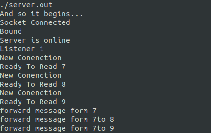
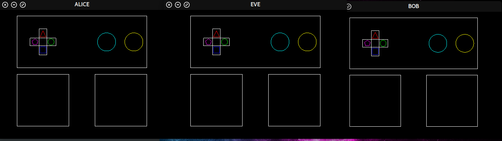
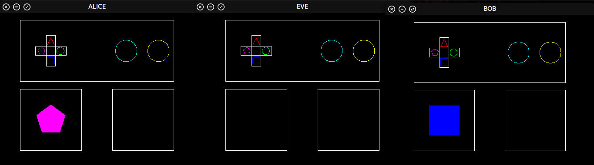
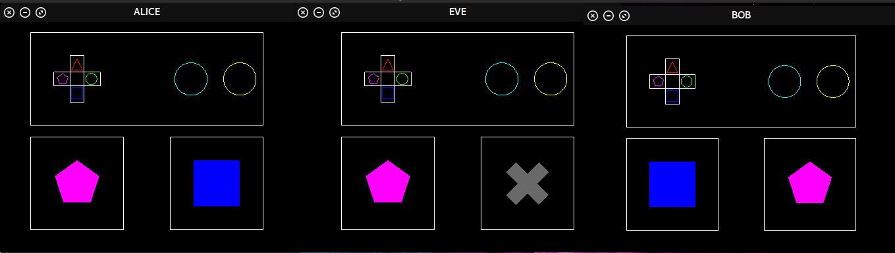

# Shape Game
## Setup
* Use 3 linux computers connecting in a lan
* Clone the repo `git clone <repo url>`
* Install `sh install.sh` (this will work only with aptitude )
* Compile `make`
* Start server `./bin/server.out 4444`
* Get server ip `ifconfig`
	* Take note of `eth0` or `enp2s0`; **note::** the numbers might be different

* Start a client 
	* Alice `./bin/server.out 1 4444 <server ip>`
	* Bob `./bin/server.out 2 4444 <server ip>`
	* Eve `./bin/server.out 3 4444 <server ip>`

## How to run 
Using the `up`, `down`, `left`, `right` arrow keys to change shape. `space bar` will send the message openly, which will demo the unsecured connection. `enter \ return ` will demo the encrypted message. 

### Encryption 
encryption is done by mapping shapes to fruit. As Eve only knows what shapes are Alice and Bob and use their fruit code to translate shapes to fruit and vise versa

## Example
### Server

### Client
Starting 

Clients select shape before send

Alice send message to Bob non-encrypted while bob used encryption. Take note that Eve can only read Alice's message.

